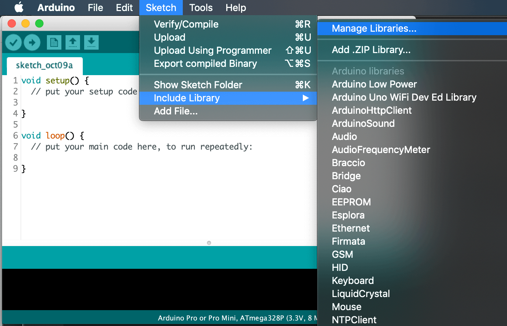
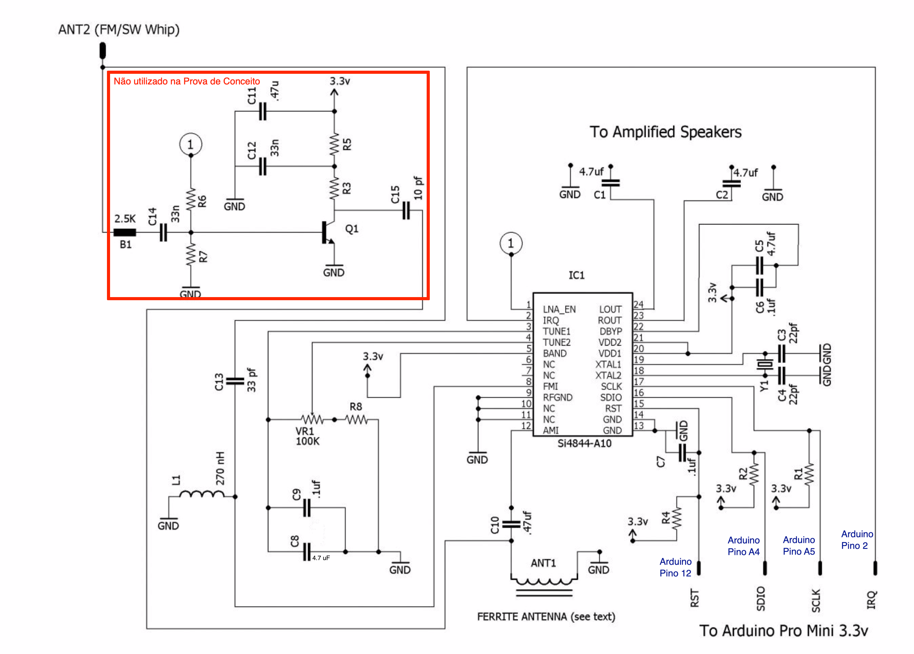
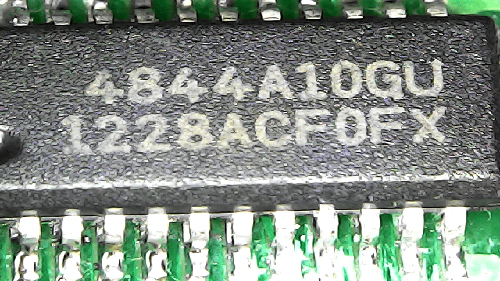

# Si4844 Library for Arduino

This is a library for the SI4844, BROADCAST ANALOG TUNING DIGITAL DISPLAY AM/FM/SW RADIO RECEIVER,  ICs from Silicon Labs for the Arduino development environment.  This library is intended to provide an easier interface for controlling the SI4844.

By Ricardo Lima Caratti, Oct, 2019. 

__Attention: Under construction.__

## Summary
1. [Your support is important]()
2. [About the SI4844 Architecture]()
3. [Library Installation]()
4. [Hardware Requirements and Setup]()
5. 

## Your support is important.

If you would like to support this library development, consider joining this project via Github. Thank you!

## About the SI4844 Architecture 

The Si4844 is an analog-tuned digital-display AM/FM/SW radio receiver. It has an analog-tune while frequency, band, and setero/mono information can be displayed on LCD. It works with a I2C protocol that allows a microcontroller send command and receive data. 

See more about SI4844 on [BROADCAST ANALOG TUNING DIGITAL DISPLAY AM/FM/SW RADIO RECEIVER](https://www.silabs.com/documents/public/data-sheets/Si4840-44-A10.pdf) 

## Library Installation

You can install the library is via the Arduino Library Manager. Go to the menu __Sketch__ > __Include Library__ > __Manage Libraries...__, and in the search box,  type __"PU2CLR SI4844"__.

The images below show that actions

## Hardware Requirements and Setup

This library has been written for the Arduino platform and has been successfully tested on Pro Mini. I beleave it will wotk on any other Arduino with I2C support.

The SI4844 is a +3.3 V only part. If you are not using a +3.3 V version of Arduino, you have to use a converter.

To use this labrary you need to build an radio based on SI4844 coneccted to Arduino. The schematic and photos below show the hardware and setup requirments for start using this library.

### Schematic

For this POC, the signal amplifier was not implemented as suggested by Raymond Genovese.

__Original Source:__ [Raymond Genovese, May 26, 2016 - How to Build an Arduino-Controlled AM/FM/SW Radio](https://www.allaboutcircuits.com/projects/build-an-arduino-controlled-am-fm-sw-radio/)
 
The document [BROADCAST ANALOG TUNING DIGITAL DISPLAY AM/FM/SW RADIO RECEIVER](https://www.silabs.com/documents/public/data-sheets/Si4840-44-A10.pdf), chapter two, page 11,  has a typical application schematic. 

The figure below shows that schematic

__Source: Silicon Labs (Si4840/44-A10)__

### Parts

Parts list  used in this POC. 

The table below is based on [Raymond Genovese, May 26, 2016 - How to Build an Arduino-Controlled AM/FM/SW Radio](https://www.allaboutcircuits.com/projects/build-an-arduino-controlled-am-fm-sw-radio/) .  

|Part	| Description |
|-------| ------------ |
|(*1) B1 	| ferrite bead 2.5 kOhm (100 mHz) B1, ferrite bead 2.5 kOhm (100 mHz), 81-BLM18BD252SZ1D |
|C1,C2,C5 |	4.7 uf non polarized capacitor |
|C3,C4 |	22 pf non polarized capacitor |
|C6,C7,C9 |	.1 uf non polarized capacitor |
|(*2) C8	| __4.7 uf non polarized capacitor__ (the orinal value is 47uF. I used 4.7uF) |
|C10, (*1) C11 |	.47 uf non polarized capacitor |
|(*1) C12, (*1) C14 |	33 nf non polarized capacitor |
|C13	| 33 pf non polarized capacitor |
|(*1) C15	| 10 pf non polarized capacitor |
|IC1	| Si4844-A10 radio receiver |
|(*1) Q1	| SS9018 NPN transistor |
|R1, R2	| 2.2K |
|(*1) R3	| 1K |
|R4, (*1) R7	| 100K |
|(*1) R5	| 10 Ohms |
|(*1) R6	| 120K |
|R8	| 100 Ohms |
|L1	| 270 nH Inductor (0,270 uH) |
|VR1 |	100K linear potentiometer |
|Y1	| 32.768 kHz crystal |
|ANT1 |	ferrite antenna |
|ANT2 | telescopic/whip antenna |

1. (*1) - not used for this project.
2. (*2) - the value used is 4.7uF and not 47uF as suggested by the original circuit.

### Photos 

### SI4844 soldered on adapter

It was a bit hard to solder the Si4844 on adapter. However, by using a electronic magnifier it was possible.

#### Protoboard

## References

1. [How to Build an Arduino-Controlled AM/FM/SW Radio](https://www.allaboutcircuits.com/projects/build-an-arduino-controlled-am-fm-sw-radio/)
2. [BROADCAST ANALOG TUNING DIGITAL DISPLAY AM/FM/SW RADIO RECEIVER](https://www.silabs.com/documents/public/data-sheets/Si4840-44-A10.pdf)
3. [Si4822/26/27/40/44 ANTENNA, SCHEMATIC, LAYOUT, AND DESIGN GUIDELINES](https://www.silabs.com/documents/public/application-notes/AN602.pdf)

   
## Videos

1. [Prova de Conceito com SI4844 e Arduino (vídeo sobre este projeto)](https://youtu.be/DAQbXZZR7VQ)

